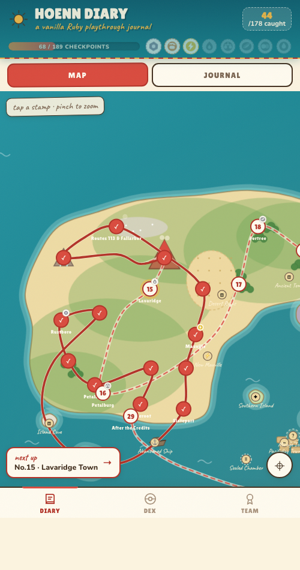
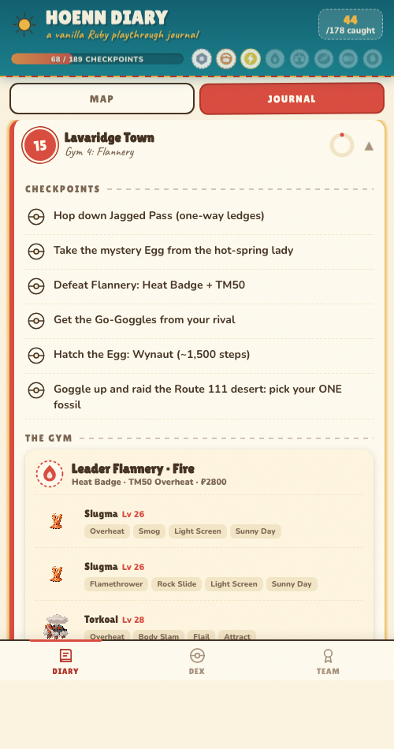
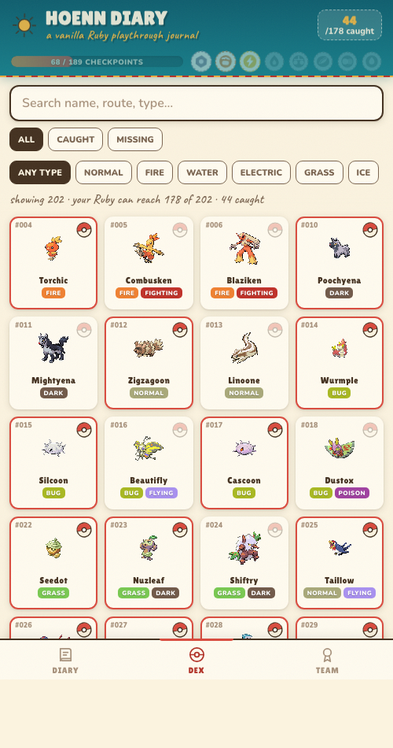
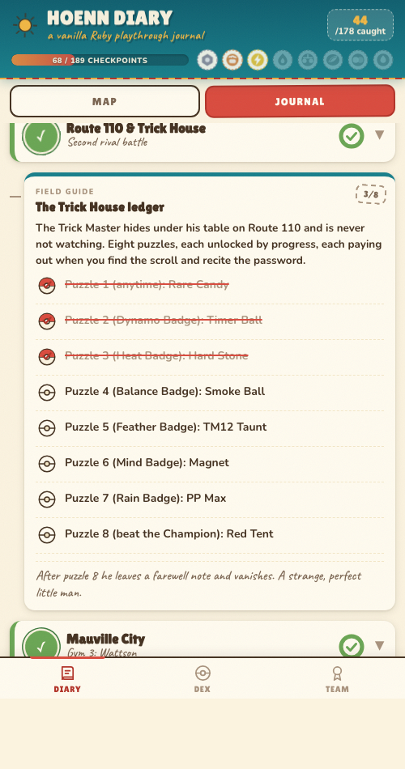
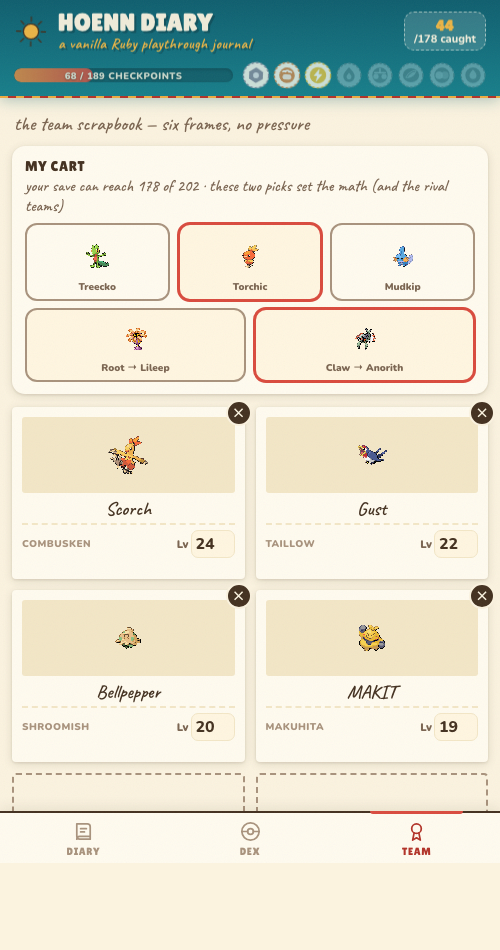
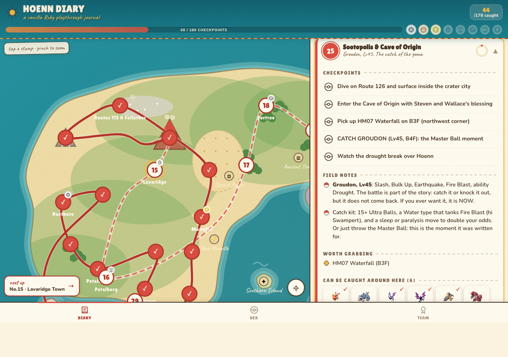

<p align="center">
  
</p>

<h1 align="center">Hoenn Diary</h1>

<p align="center">
  <b>A playthrough journal for vanilla Pokémon Ruby</b><br>
  The cart runs in a GBA SP. This runs on the phone sitting next to it.
</p>

<p align="center">
  
  
  
  
</p>

<p align="center">
  <a href="https://vercel.com/new/clone?repository-url=https://github.com/aurph/hoenn-diary">
    
  </a>
</p>

---

<p align="center">
  
  &nbsp;&nbsp;
  
</p>

## What it is

One self-contained HTML file (~240 KB) that plays travel journal for an original
Ruby cartridge: an illustrated, pan-and-zoom map of Hoenn stitched to a full
chapter-by-chapter walkthrough with **189 checkable checkpoints**, every boss
team in the game, the secrets and side quests placed exactly where they unlock,
and a Pokédex tracker that counts only what **one cartridge with no link cable**
can actually catch.

All progress lives in `localStorage`. No accounts, no server, no build step at
runtime. Sprites load from Pokémon Showdown's public Gen 3 sprite CDN.

## The three tabs

**DIARY** — the whole run as one thing. A hand-drawn SVG Hoenn (animated sea,
smoking Mt. Chimney, the Sootopolis crater) where a red thread traces your
journey: dashed ahead of you, solid behind you. Every numbered stamp is a
chapter; tap one and the journal opens to it. Chapters hold checkpoints, gym
teams with movesets and a battle plan, every Team Magma fight with exact
levels, rival battles that adapt to your starter, items worth grabbing, and
what's catchable nearby. Side-quest cards (Feebas's six tiles, the Regi code,
the Trick House ledger, dead-battery survival) sit in the timeline right where
they unlock. The map pins fill with golden progress arcs as you check things
off, and a "next up" chip always knows where you left off.

**DEX** — all 202 Hoenn entries with Gen 3-correct types, abilities, stats, and
every Ruby acquisition route (encounter rates, levels, gifts, fossils, statics,
breeding). The headline number is honest: **186** is the most one vanilla Ruby
can ever hold, and once you tell the app your starter and fossil picks it
becomes **your** number (178). Sapphire exclusives, trade evolutions, Jirachi,
Deoxys and Latias sit on a shelf labeled *needs a link cable or event*; the
starter and fossil lines you didn't pick move to *the road not taken*. Neither
counts against you.

**TEAM** — a six-slot scrapbook with nicknames and levels, plus a gym radar
that compares your team's typing against the *actual rosters* of every gym,
Elite Four member and the Champion you haven't beaten yet.

<p align="center">
  
  &nbsp;
  
  &nbsp;
  
</p>

<p align="center">
  
</p>

## Accuracy, with receipts

Every trainer team, level, moveset, TM and version mechanic was checked against
Bulbapedia's **Ruby/Sapphire** data, not Emerald's, because guides love to mix
them up. Things this diary gets right that the internet often doesn't:

- **Sky Pillar opens after the Hall of Fame** in Ruby/Sapphire. Pre-Elite-Four
  Rayquaza is an Emerald thing.
- The Regi caves use the **R/S rituals**: right-right-down-down + Strength,
  stand still two minutes, Fly in the center. The Rock Smash version you read
  about is Emerald.
- **Altering Cave is not in this game.** At all.
- In Ruby, Maxie steals the **Blue Orb** (the wrong one) and you get the Red Orb.
- The lottery ladder is PP Up → Exp. Share → Max Revive → Rare Candy → Master
  Ball, and the Lilycove rooftop clearance sale is real (post-champion,
  announced on TV).
- Real-hardware honesty throughout: what a dead CR1616 battery kills (berries,
  tides, lottery), what survives (everything else, including Feebas hunting),
  and the 366-day berry glitch.

## Put it on your phone

1. Hit the **Deploy with Vercel** button above (framework preset: *Other*,
   no build command, output directory: root). Vercel serves `index.html` as is.
2. Open your deployment URL in Safari on the phone.
3. Share → **Add to Home Screen.** It installs with its own icon and runs
   standalone, like an app.

No Vercel? The file works anywhere static files are served, and `index.html`
even survives being AirDropped around as a single file.

## Rebuilding from source

The app is generated, never hand-edited:

```
data/species.mjs      @pkmn/dex pinned to Gen 3  → species.json   (types, stats, abilities, evos)
data/encounters.py    PokeAPI, version=ruby      → encounters_ruby.json (every wild slot + rate)
data/manual_data.py   the authored layer: chapters, checkpoints, teams, side quests, map geometry
build.py              stitches it all into index.html
```

```bash
npm install          # only @pkmn/dex, only for regenerating species data
npm run data         # refetch species + encounters (cached, polite)
npm run build        # data + template.html -> index.html
```

### URL params

| Param | What it does |
|---|---|
| `?selftest=1` | runs the 36-test in-page suite, prints results |
| `?demo=1` | loads a mid-journey demo state (in memory only, never saved) |
| `?ch=lavaridge` / `?side=s-regi` | deep-link to a chapter or side quest |
| `?view=dex&mon=feebas` | open a tab / a Pokémon's page |
| `?k=2&cx=320&cy=350` | start the map at a zoom and position |

## Disclaimer

Fan project, not affiliated with or endorsed by Nintendo, Creatures Inc., GAME
FREAK inc. or The Pokémon Company. No game assets are bundled; pixel sprites
are hotlinked at runtime from
[Pokémon Showdown](https://play.pokemonshowdown.com)'s public sprite archive.
Species and encounter data from [PokeAPI](https://pokeapi.co) and
[@pkmn/dex](https://github.com/pkmn/ps); facts cross-checked on
[Bulbapedia](https://bulbapedia.bulbagarden.net). Code is MIT.

<p align="center">
  <sub>made for a GBA SP and the iPhone sitting next to it</sub>
</p>
